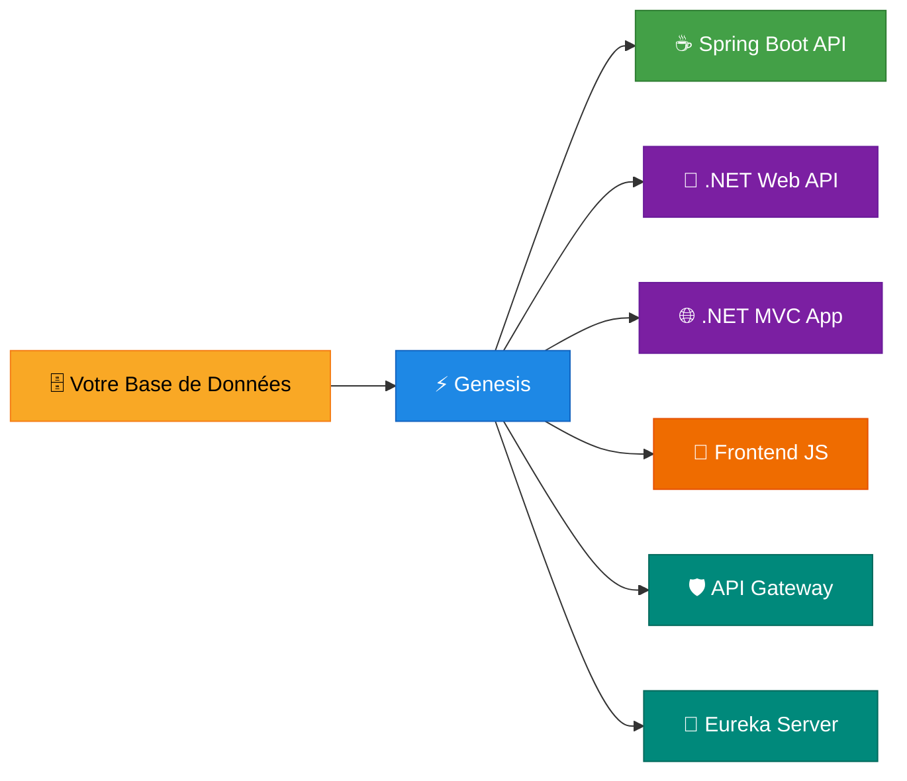
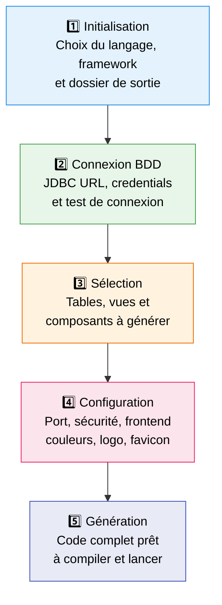
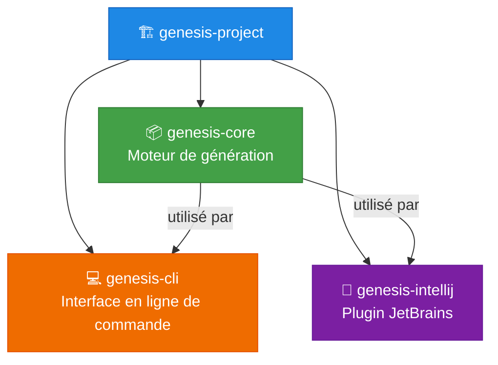

<a id="readme-top"></a>

<!-- PROJECT SHIELDS -->
[![Contributors][contributors-shield]][contributors-url]
[![Forks][forks-shield]][forks-url]
[![Stargazers][stars-shield]][stars-url]
[![Issues][issues-shield]][issues-url]
[![MIT License][license-shield]][license-url]

<!-- PROJECT LOGO -->
<br />
<div align="center">
  <h1>⚡ Genesis</h1>

  <p align="center">
    <b>Des bases de données aux applications complètes — en quelques clics.</b>
    <br />
    Plugin JetBrains + CLI pour générer vos projets Spring Boot, .NET MVC et frontend JS automatiquement.
    <br />
    <br />
    <a href="https://github.com/superealabs/Genesis/issues/new?labels=bug&template=bug-report---.md">🐛 Report Bug</a>
    &middot;
    <a href="https://github.com/superealabs/Genesis/issues/new?labels=enhancement&template=feature-request---.md">✨ Request Feature</a>
  </p>
</div>

---

<!-- TABLE OF CONTENTS -->
<details>
  <summary>📑 Table des matières</summary>
  <ol>
    <li><a href="#-pourquoi-genesis-">🎯 Pourquoi Genesis ?</a></li>
    <li><a href="#-fonctionnalités-clés">🚀 Fonctionnalités clés</a></li>
    <li><a href="#-comment-ça-marche-">🔧 Comment ça marche ?</a></li>
    <li><a href="#-technologies-supportées">🏗 Technologies supportées</a></li>
    <li><a href="#-prérequis">📋 Prérequis</a></li>
    <li><a href="#-installation--prise-en-main">⚙ Installation & Prise en main</a></li>
    <li><a href="#%EF%B8%8F-utilisation-dans-intellij-idea">🖥️ Utilisation dans IntelliJ IDEA</a></li>
    <li><a href="#-utilisation-dans-rider">🐴 Utilisation dans Rider</a></li>
    <li><a href="#-utilisation-en-cli">💻 Utilisation en CLI</a></li>
    <li><a href="#-architecture-du-projet">🧱 Architecture du projet</a></li>
    <li><a href="#-roadmap">🗺 Roadmap</a></li>
    <li><a href="#-contribuer">🤝 Contribuer</a></li>
    <li><a href="#-obtenir-de-laide">💬 Obtenir de l'aide</a></li>
    <li><a href="#-licence">📜 Licence</a></li>
  </ol>
</details>

---

## 🎯 Pourquoi Genesis ?

> **Arrêtez d'écrire du boilerplate. Concentrez-vous sur la logique métier.**

Vous avez une base de données ? Genesis s'occupe du reste. En adoptant une approche **Database-First**, Genesis analyse votre schéma existant et génère automatiquement :

- ✅ Les **modèles** (entités JPA, classes C# avec Data Annotations)
- ✅ Les **contrôleurs** REST ou MVC
- ✅ Les **repositories/DAOs**
- ✅ Les **vues frontend** complètes (HTML/CSS/JS)
- ✅ Les **fichiers de configuration** (application.properties, appsettings.json, etc.)
- ✅ La **sécurité** (Spring Security, ASP.NET Identity)
- ✅ Les **annotations de validation** extraites directement de vos contraintes SQL

Tout ça en **quelques clics** depuis IntelliJ IDEA, Rider, ou en ligne de commande.

<p align="right">(<a href="#readme-top">back to top</a>)</p>

---

## 🚀 Fonctionnalités clés

| Fonctionnalité | Description |
|---|---|
| 🔌 **Plugin JetBrains** | Intégré à IntelliJ IDEA et Rider via le menu **Tools > Genesis Project Generator** |
| 🗃️ **Database-First** | Connectez-vous à votre BDD, sélectionnez vos tables/vues, Genesis fait le reste |
| 🧠 **Génération SQL par IA** | Décrivez vos tables en langage naturel, Genesis génère le SQL via LLM (Groq) |
| 🎨 **Templates Frontend** | Vues CRUD avec filtres avancés, tri multi-colonnes, pagination et export |
| 🔒 **Sécurité intégrée** | Génération automatique de l'authentification (Spring Security / ASP.NET Identity) |
| 🌐 **Multi-frameworks** | Spring Boot, .NET Web API, .NET MVC, API Gateway, Eureka Server |
| 🛡️ **Validation automatique** | Les contraintes SQL (`CHECK`, `UNIQUE`, `NOT NULL`, regex) sont converties en annotations |
| 📦 **Multi-SGBD** | PostgreSQL, MySQL, SQL Server, Oracle |
| 🌍 **i18n** | Support de l'internationalisation dans les vues générées |
| 🎛️ **Personnalisable** | Couleurs, logo, favicon, CSS personnalisé, navbar configurable |

<p align="right">(<a href="#readme-top">back to top</a>)</p>

---

## 🔧 Comment ça marche ?



### Le workflow Genesis en 5 étapes



<p align="right">(<a href="#readme-top">back to top</a>)</p>

---

## 🏗 Technologies supportées

### Types de projets générés

| # | Type de projet | Backend | Frontend |
|--|--|--|--|
| 1 | **Web API Spring Boot** | Java + Spring Boot | — |
| 2 | **Web API .NET** | C# + ASP.NET Core | — |
| 3 | **MVC .NET** | C# + ASP.NET MVC | Razor Views + JS |
| 4 | **Spring Boot + Gateway** | Java + Spring Cloud | — |
| 5 | **.NET + Gateway** | C# + ASP.NET Core | — |
| 6 | **Architecture complète** | Spring Boot + .NET + Eureka + Gateway | — |

### Backends

| Stack | Versions | Outils |
|--|--|--|
| ☕ **Java / Spring Boot** | Java 17-23, Spring Boot 3.2-3.3 | Maven, Spring Data JPA, Spring Security, Swagger |
| 🔷 **C# / .NET** | C# 8.0-9.0, .NET 8+ | Entity Framework Core, ASP.NET Core, Identity |
| 🌐 **MVC .NET** | ASP.NET Core MVC | Razor Views, CRUD complet, filtres, tri, pagination |

### Frontend (Template 1)

| Fonctionnalité | Détail |
|--|--|
| 📋 **Liste** | Tableau avec tri multi-colonnes, pagination, filtres dynamiques |
| 🔍 **Détail** | Vue détaillée avec champs formatés |
| ✏️ **Formulaire** | Création et édition avec validation côté client |
| 🗑️ **Suppression** | Modale de confirmation |
| 📤 **Export** | Export des données |
| 🌍 **i18n** | Support multilingue intégré |

### 🗄️ Bases de données supportées

| SGBD | Versions testées | Driver |
|--|--|--|
| 🐘 **PostgreSQL** | 15, 16 | postgresql |
| 🐬 **MySQL** | 8.0+ | mysql-connector-j |
| 🪟 **SQL Server** | 2022 | mssql-jdbc |
| 🔶 **Oracle** | 19c | ojdbc8 |

<p align="right">(<a href="#readme-top">back to top</a>)</p>

---

## 📋 Prérequis

| Outil | Version minimale | Notes |
|--|--|--|
| **Java** | 21 | JDK (OpenJDK recommandé) |
| **Gradle** | 8.11+ | Ou utiliser le wrapper `./gradlew` |
| **IDE** | IntelliJ IDEA 2025.1+ / Rider 2025.1+ | Ultimate ou Community Edition |

> [!TIP]
> Si Gradle n'est pas installé localement, utilisez `./gradlew` (Linux/Mac) ou `gradlew.bat` (Windows).

<p align="right">(<a href="#readme-top">back to top</a>)</p>

---

## ⚙ Installation & Prise en main

### 1. Cloner le projet

```bash
git clone https://github.com/superealabs/Genesis.git
cd Genesis
```

### 2. Construire le projet

```bash
gradle clean build -x test
```

### 3. Installer le plugin dans votre IDE

#### Option A : Mode développement (Live)

Lancez une instance de l'IDE avec Genesis pré-installé :

```bash
gradle genesis-intellij:runIde
```

#### Option B : Installer le .zip

1. Construisez le plugin :
   ```bash
   gradle genesis-intellij:buildPlugin
   ```
2. Le fichier `.zip` sera généré dans `genesis-intellij/build/distributions/`
3. Dans votre IDE : **Settings > Plugins > ⚙️ > Install Plugin from Disk...**
4. Sélectionnez le fichier `.zip` et redémarrez

#### Option C : JetBrains Marketplace

> *Bientôt disponible !* Recherchez « Genesis » dans le Marketplace.

<p align="right">(<a href="#readme-top">back to top</a>)</p>

---

## 🖥️ Utilisation dans IntelliJ IDEA

Genesis s'intègre dans IntelliJ IDEA de **deux façons** :

### Méthode 1 : Nouveau Projet

> 📍 **File > New > Project...**

1. Dans la fenêtre de création de projet, sélectionnez **Genesis** dans la liste des générateurs (panneau de gauche)
2. Suivez l'assistant étape par étape :
   - **Initialisation** : choisissez le langage (Java/C#), le framework et le dossier de sortie
   - **Connexion BDD** : entrez l'URL JDBC, testez la connexion
   - **Sélection** : cochez les tables et vues à inclure
   - **Configuration** : port, sécurité, frontend, couleurs...
3. Cliquez sur **Create** → votre projet est généré ! 🎉

### Méthode 2 : Menu Tools (projet existant)

> 📍 **Tools > Genesis Project Generator**

1. Ouvrez n'importe quel projet dans IntelliJ
2. Allez dans **Tools > Genesis Project Generator**
3. Le même assistant apparaît dans une fenêtre de dialogue
4. Générez votre code dans le dossier de votre choix

> [!TIP]
> La méthode par le menu **Tools** est idéale quand vous voulez générer du code dans un projet existant sans créer un nouveau projet IntelliJ.

<p align="right">(<a href="#readme-top">back to top</a>)</p>

---

## 🐴 Utilisation dans Rider

Dans Rider, le `ModuleBuilder` d'IntelliJ n'est pas disponible. Genesis s'utilise donc **exclusivement via le menu Tools** :

> 📍 **Tools > Genesis Project Generator**

1. Ouvrez Rider avec n'importe quelle solution ou projet
2. Allez dans **Tools > Genesis Project Generator**
3. L'assistant Genesis s'ouvre — le workflow est **identique** à IntelliJ :
   - Initialisation → Connexion BDD → Sélection → Configuration → Génération
4. Choisissez votre dossier de sortie et générez votre projet .NET MVC ou Web API

> [!NOTE]
> Le plugin déclare la dépendance `com.intellij.modules.platform`, ce qui le rend compatible avec **tous les IDE JetBrains** (IntelliJ, Rider, WebStorm, etc.).

<p align="right">(<a href="#readme-top">back to top</a>)</p>

---

## 💻 Utilisation en CLI

Genesis est aussi disponible en ligne de commande, sans IDE.

### Lancer directement

```bash
gradle genesis-cli:run
```

### Construire un JAR exécutable

```bash
gradle genesis-cli:shadowJar
java -jar genesis-cli/build/libs/genesis-cli-0.0.1.jar
```

### Depuis les Releases GitHub

1. Téléchargez le dernier `.jar` depuis la [page Releases](https://github.com/superealabs/Genesis/releases)
2. Exécutez :
   ```bash
   java -jar genesis-cli-x.x.x.jar
   ```

<p align="right">(<a href="#readme-top">back to top</a>)</p>

---

## 🧱 Architecture du projet

Genesis est un projet **multi-module Gradle** :



| Module | Rôle |
|--|--|
| `genesis-core` | 🧠 Cœur du projet. Contient la logique de génération, les templates, les mappings SGBD, les modèles de frameworks et le moteur de template Mustache-like |
| `genesis-cli` | 💻 Interface en ligne de commande. Utilise `genesis-core` pour générer des projets de manière interactive dans le terminal |
| `genesis-intellij` | 🔌 Plugin JetBrains. Fournit un assistant graphique (wizard) intégré dans IntelliJ IDEA et Rider, avec sélecteur de BDD, preview des tables, et configuration visuelle |

### Contenu clé de `genesis-core`

```
genesis-core/src/main/resources/data_genesis/
├── json/               # Mappings de types (databases.json, languages.json)
├── yaml/               # Définitions de frameworks, requêtes de contraintes
│   ├── frameworks.yaml           # Spring Boot, .NET Web API
│   ├── frameworks-mvc.yaml       # .NET MVC (vues Razor, contrôleurs CRUD)
│   ├── constraint-queries.yaml   # Requêtes SQL pour extraire les contraintes
│   └── framework-securities.yaml # Configuration de sécurité par framework
└── templates/          # Templates frontend (HTML, CSS, JS)
    └── Template 1/     # Template par défaut avec design moderne
```

<p align="right">(<a href="#readme-top">back to top</a>)</p>

---

## 🗺 Roadmap

- [x] 🔌 Plugin IntelliJ IDEA
- [x] 💻 CLI interactive
- [x] 🐘 Support PostgreSQL, MySQL, SQL Server, Oracle
- [x] ☕ Génération Spring Boot Web API
- [x] 🔷 Génération .NET Web API
- [x] 🌐 Génération .NET MVC (Razor + CRUD complet)
- [x] 🛡️ API Gateway + Eureka Server
- [x] 🔒 Sécurité (Spring Security, ASP.NET Identity)
- [x] 🎨 Templates frontend avec filtres, tri et pagination
- [x] 🧠 Génération SQL par IA (LLM)
- [x] 🐴 Compatibilité Rider (via Tools menu)
- [ ] 📱 Support React / Angular / Vue.js (frontend séparé)
- [ ] 🧪 Tests unitaires générés automatiquement
- [ ] 📊 Dashboard de monitoring des projets générés
- [ ] 🔄 Mode incrémental (regénérer uniquement ce qui a changé)

<p align="right">(<a href="#readme-top">back to top</a>)</p>

---

## 🤝 Contribuer

Les contributions sont ce qui fait de la communauté open source un endroit incroyable pour apprendre, s'inspirer et créer. Toute contribution est **grandement appréciée** ! 🙏

1. Forkez le projet
2. Créez votre branche (`git checkout -b feature/MaSuperFonctionnalite`)
3. Commitez vos changements (`git commit -m '[Feature] Ma super fonctionnalité'`)
4. Poussez la branche (`git push origin feature/MaSuperFonctionnalite`)
5. Ouvrez une Pull Request

<p align="right">(<a href="#readme-top">back to top</a>)</p>

---

## 💬 Obtenir de l'aide

- 📖 Consultez ce README et les fichiers de configuration pour comprendre le fonctionnement
- 🐛 Ouvrez une [issue](https://github.com/superealabs/Genesis/issues) pour signaler un bug
- 💡 Proposez une [feature](https://github.com/superealabs/Genesis/issues/new?labels=enhancement) pour partager vos idées
- 📧 Contactez-nous : **vahatra.nomena@yahoo.com**

<p align="right">(<a href="#readme-top">back to top</a>)</p>

---

## 📜 Licence

Distribué sous la licence **MIT**. Voir le fichier [`LICENSE`](LICENSE) pour plus d'informations.

<p align="right">(<a href="#readme-top">back to top</a>)</p>

---

<div align="center">
  <p>Fait avec ❤️ par <a href="https://github.com/superealabs">Superealabs</a></p>
  <p>⭐ Si Genesis vous a aidé, n'hésitez pas à mettre une étoile au projet !</p>
</div>

<!-- MARKDOWN LINKS & IMAGES -->
[contributors-shield]: https://img.shields.io/github/contributors/superealabs/Genesis.svg?style=for-the-badge
[contributors-url]: https://github.com/superealabs/Genesis/graphs/contributors
[forks-shield]: https://img.shields.io/github/forks/superealabs/Genesis.svg?style=for-the-badge
[forks-url]: https://github.com/superealabs/Genesis/network/members
[stars-shield]: https://img.shields.io/github/stars/superealabs/Genesis.svg?style=for-the-badge
[stars-url]: https://github.com/superealabs/Genesis/stargazers
[issues-shield]: https://img.shields.io/github/issues/superealabs/Genesis.svg?style=for-the-badge
[issues-url]: https://github.com/superealabs/Genesis/issues
[license-shield]: https://img.shields.io/github/license/superealabs/Genesis.svg?style=for-the-badge
[license-url]: https://github.com/superealabs/Genesis/blob/master/LICENSE