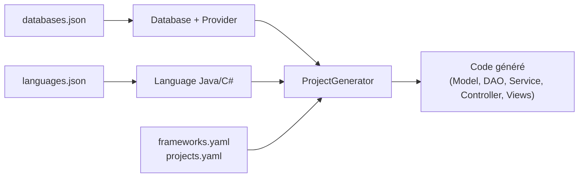

# Audit du module `genesis-core`

> **Date de création** : 17 mars 2026  
> **Dernière mise à jour** : 22 mars 2026  
> **Scope** : Module `genesis-core` du projet Genesis — couche métier, connexion DB, configuration langages & frameworks.

---

## 1. Vue d'ensemble de l'architecture

Le module `genesis-core` est le cœur du projet Genesis. Il lit les métadonnées d'une base de données (tables, vues, colonnes, contraintes) et génère du code source (projets Spring Boot API, .NET MVC, etc.) à partir de templates.

### Flux principal



### Fichiers de configuration clés

| Fichier | Format | Rôle |
|---------|--------|------|
| [databases.json](file:///Users/nomena/TAFF/genesis-project/genesis-core/src/main/resources/data_genesis/json/databases.json) | JSON | Définition des 4 SGBD (types, drivers, connexion) |
| [languages.json](file:///Users/nomena/TAFF/genesis-project/genesis-core/src/main/resources/data_genesis/json/languages.json) | JSON | Types cibles Java/C#, annotations, mocks, criteria |
| [constraint-queries.yaml](file:///Users/nomena/TAFF/genesis-project/genesis-core/src/main/resources/data_genesis/yaml/constraint-queries.yaml) | YAML | Requêtes SQL de détection des contraintes CHECK |
| [frameworks.yaml](file:///Users/nomena/TAFF/genesis-project/genesis-core/src/main/resources/data_genesis/yaml/frameworks.yaml) | YAML | Config des frameworks backend (Spring, .NET) |
| [frameworks-mvc.yaml](file:///Users/nomena/TAFF/genesis-project/genesis-core/src/main/resources/data_genesis/yaml/frameworks-mvc.yaml) | YAML | Config des frameworks MVC (Spring MVC, .NET MVC) |
| [projects.yaml](file:///Users/nomena/TAFF/genesis-project/genesis-core/src/main/resources/data_genesis/yaml/projects.yaml) | YAML | Config des types de projets (Maven, ASP) |
| [input-type-mapping.json](file:///Users/nomena/TAFF/genesis-project/genesis-core/src/main/resources/data_genesis/json/input-type-mapping.json) | JSON | Mapping types frontend pour les formulaires |

---

## 2. Bases de données supportées et versions des drivers JDBC

| # | SGBD | Driver JDBC | Version | Port par défaut | Classe Provider |
|---|------|-------------|---------|-----------------|-----------------|
| 1 | **MySQL** | `com.mysql.cj.jdbc.Driver` | `mysql-connector-j` **9.0.0** | 3306 | [MySQLDatabase.java](file:///Users/nomena/TAFF/genesis-project/genesis-core/src/main/java/org/labs/genesis/connexion/providers/MySQLDatabase.java) |
| 2 | **PostgreSQL** | `org.postgresql.Driver` | `postgresql` **42.7.3** | 5432 | [PostgreSQLDatabase.java](file:///Users/nomena/TAFF/genesis-project/genesis-core/src/main/java/org/labs/genesis/connexion/providers/PostgreSQLDatabase.java) |
| 3 | **SQL Server** | `com.microsoft.sqlserver.jdbc.SQLServerDriver` | `mssql-jdbc` **12.8.1.jre11** | 1433 | [SQLServerDatabase.java](file:///Users/nomena/TAFF/genesis-project/genesis-core/src/main/java/org/labs/genesis/connexion/providers/SQLServerDatabase.java) |
| 4 | **Oracle** | `oracle.jdbc.driver.OracleDriver` | `ojdbc8` **19.8.0.0** | 1521 | [OracleDatabase.java](file:///Users/nomena/TAFF/genesis-project/genesis-core/src/main/java/org/labs/genesis/connexion/providers/OracleDatabase.java) |

### Versions réelles stables supportées

Le tableau ci-dessous croise les exigences du **driver JDBC** avec les **fonctions SQL réellement utilisées** dans les requêtes de contraintes ([constraint-queries.yaml](file:///Users/nomena/TAFF/genesis-project/genesis-core/src/main/resources/data_genesis/yaml/constraint-queries.yaml)) et dans le code Java des providers.

| SGBD | Version minimale réelle | Versions stables recommandées | Raison limitante |
|------|------------------------|-------------------------------|------------------|
| **MySQL** | **8.0.16** | 8.0.x, 8.4 LTS, 9.x | CHECK constraints + `REGEXP_SUBSTR` |
| **PostgreSQL** | **9.3** | 12.x, 13.x, 14.x, 15.x, 16.x, 17.x | `CROSS JOIN LATERAL` |
| **SQL Server** | **2012** | 2016, 2017, 2019, 2022 | `TRY_CAST()` |
| **Oracle** | **10g R2** | 12c, 18c, 19c (LTS), 21c, 23ai | `REGEXP_LIKE` côté Java |

> [!IMPORTANT]
> **MySQL 5.7 est incompatible** malgré le support du driver JDBC 9.0.0. Les requêtes de contraintes échoueront systématiquement.

---

### Analyse détaillée des fonctions SQL bloquantes par SGBD

#### MySQL — Version minimale : **8.0.16**

| Fonction / Feature SQL utilisée | Introduite en | Fichier source |
|---------------------------------|---------------|----------------|
| `WITH` (CTE — Common Table Expressions) | MySQL **8.0.1** | [constraint-queries.yaml](file:///Users/nomena/TAFF/genesis-project/genesis-core/src/main/resources/data_genesis/yaml/constraint-queries.yaml#L4) — toutes les queries MySQL |
| `REGEXP_SUBSTR()` | MySQL **8.0.4** | [constraint-queries.yaml](file:///Users/nomena/TAFF/genesis-project/genesis-core/src/main/resources/data_genesis/yaml/constraint-queries.yaml#L27) — queries min/max/strict |
| `REGEXP_REPLACE()` | MySQL **8.0.4** | [constraint-queries.yaml](file:///Users/nomena/TAFF/genesis-project/genesis-core/src/main/resources/data_genesis/yaml/constraint-queries.yaml#L85) — query max |
| Lookbehind [(?<=...)](file:///Users/nomena/TAFF/genesis-project/genesis-core/src/main/java/org/labs/genesis/connexion/Database.java#72-76) dans `REGEXP_SUBSTR` | MySQL **8.0** (moteur ICU) | [constraint-queries.yaml](file:///Users/nomena/TAFF/genesis-project/genesis-core/src/main/resources/data_genesis/yaml/constraint-queries.yaml#L42) — query min between |
| `information_schema.CHECK_CONSTRAINTS` | MySQL **8.0.16** | [constraint-queries.yaml](file:///Users/nomena/TAFF/genesis-project/genesis-core/src/main/resources/data_genesis/yaml/constraint-queries.yaml#L11) — **toutes** les queries MySQL |
| CHECK constraints **enforced** (pas ignorés) | MySQL **8.0.16** | Avant 8.0.16, `CREATE TABLE ... CHECK(...)` était parsé mais ignoré silencieusement |

> [!CAUTION]
> **MySQL < 8.0.16** : les CHECK constraints existent syntaxiquement mais sont **ignorées par le moteur**. La table `information_schema.CHECK_CONSTRAINTS` est vide. Genesis ne détectera aucune contrainte CHECK.
>
> **MySQL 5.7** : `REGEXP_SUBSTR`, CTE (`WITH`), et `CHECK_CONSTRAINTS` sont tous absents → **crash garanti** des requêtes de contraintes.

> [!TIP]
> **Mise à jour de robustesse (Mars 2026)** : Les requêtes MySQL (`REGEXP_SUBSTR`, `REGEXP_REPLACE`) gèrent désormais nativement l'omission ou la présence des backticks (`` \` ``) autour des colonnes dans la clause `CHECK_CLAUSE`, prévenant les erreurs de parsing des limites maximales et minimales de la base.

#### PostgreSQL — Version minimale : **9.3**

| Fonction / Feature SQL utilisée | Introduite en | Fichier source |
|---------------------------------|---------------|----------------|
| `pg_constraint`, `pg_class`, `pg_get_constraintdef()` | PostgreSQL **7.0+** | [constraint-queries.yaml](file:///Users/nomena/TAFF/genesis-project/genesis-core/src/main/resources/data_genesis/yaml/constraint-queries.yaml#L264-L266) |
| `regexp_matches()`, `regexp_replace()` | PostgreSQL **7.4** | [constraint-queries.yaml](file:///Users/nomena/TAFF/genesis-project/genesis-core/src/main/resources/data_genesis/yaml/constraint-queries.yaml#L278) |
| `WITH` (CTE) | PostgreSQL **8.4** | [constraint-queries.yaml](file:///Users/nomena/TAFF/genesis-project/genesis-core/src/main/resources/data_genesis/yaml/constraint-queries.yaml#L262) |
| `CROSS JOIN LATERAL` | PostgreSQL **9.3** | [constraint-queries.yaml](file:///Users/nomena/TAFF/genesis-project/genesis-core/src/main/resources/data_genesis/yaml/constraint-queries.yaml#L552) — queries notBlank, minLength |
| Opérateur `~*` (regex case-insensitive) | PostgreSQL **7.4** | [constraint-queries.yaml](file:///Users/nomena/TAFF/genesis-project/genesis-core/src/main/resources/data_genesis/yaml/constraint-queries.yaml#L596) |

> [!NOTE]
> PostgreSQL est le SGBD le plus rétrocompatible. La feature limitante est `CROSS JOIN LATERAL` (9.3), mais les versions < 12 ne reçoivent plus de mises à jour de sécurité. **PG 12+ est fortement recommandé** en production.

#### SQL Server — Version minimale : **2012 (v11.0)**

| Fonction / Feature SQL utilisée | Introduite en | Fichier source |
|---------------------------------|---------------|----------------|
| `sys.check_constraints`, `sys.tables`, `sys.schemas` | SQL Server **2005** | [constraint-queries.yaml](file:///Users/nomena/TAFF/genesis-project/genesis-core/src/main/resources/data_genesis/yaml/constraint-queries.yaml#L636-L638) |
| `WITH` (CTE) | SQL Server **2005** | [constraint-queries.yaml](file:///Users/nomena/TAFF/genesis-project/genesis-core/src/main/resources/data_genesis/yaml/constraint-queries.yaml#L630) |
| `CHARINDEX`, `SUBSTRING`, `LTRIM`, `RTRIM` | Toutes versions | Fonctions de base |
| `TRY_CAST()` | SQL Server **2012** | [constraint-queries.yaml](file:///Users/nomena/TAFF/genesis-project/genesis-core/src/main/resources/data_genesis/yaml/constraint-queries.yaml#L650) — queries min/max numériques |
| `PATINDEX` | Toutes versions | [constraint-queries.yaml](file:///Users/nomena/TAFF/genesis-project/genesis-core/src/main/resources/data_genesis/yaml/constraint-queries.yaml#L909) — query minLength |

> [!NOTE]
> SQL Server 2008/2008R2 échouerait uniquement sur les queries de contraintes min/max numériques à cause de `TRY_CAST`. Les PK/FK/types fonctionneraient. SQL Server 2012+ est requis pour un fonctionnement complet. **SQL Server ≤ 2014 est en fin de support Microsoft.**

#### Oracle — Version minimale : **10g Release 2 (10.2)**

| Fonction / Feature SQL utilisée | Introduite en | Fichier source |
|---------------------------------|---------------|----------------|
| `all_constraints`, `all_cons_columns` | Toutes versions | [constraint-queries.yaml](file:///Users/nomena/TAFF/genesis-project/genesis-core/src/main/resources/data_genesis/yaml/constraint-queries.yaml#L957-L958) |
| `UPPER()` | Toutes versions | Fonction de base |
| `search_condition` (colonne LONG) | Toutes versions | Retournée par la query, parsée côté Java |
| `REGEXP_LIKE` (détecté côté Java dans [OracleDatabase.java](file:///Users/nomena/TAFF/genesis-project/genesis-core/src/main/java/org/labs/genesis/connexion/providers/OracleDatabase.java)) | Oracle **10g** | [OracleDatabase.java](file:///Users/nomena/TAFF/genesis-project/genesis-core/src/main/java/org/labs/genesis/connexion/providers/OracleDatabase.java#L420-L421) |
| Vue [tab](file:///Users/nomena/TAFF/genesis-project/genesis-core/src/main/java/org/labs/genesis/connexion/Database.java#19-493) pour lister les tables | Oracle **7+** (obsolète) | [OracleDatabase.java](file:///Users/nomena/TAFF/genesis-project/genesis-core/src/main/java/org/labs/genesis/connexion/providers/OracleDatabase.java#L550) |
| Driver `ojdbc8` 19.8.0 | Certifié Oracle **12.2+** | [build.gradle.kts](file:///Users/nomena/TAFF/genesis-project/genesis-core/build.gradle.kts#L19) |

> [!WARNING]
> Les requêtes SQL Oracle sont **simples** (pas de regex SQL, pas de CTE), mais le **driver `ojdbc8` 19.8.0** est certifié uniquement pour **Oracle 12.2+** par Oracle Corporation. Utiliser Oracle 10g/11g avec ce driver n'est pas officiellement supporté.
>
> **Version minimale effective : Oracle 12c R2 (12.2)** à cause du driver.

### Résumé des versions

```
┌────────────────┬──────────────────────┬──────────────────────────────────────┐
│     SGBD       │   Version min.       │   Raison                             │
│                │   fonctionnelle      │                                      │
├────────────────┼──────────────────────┼──────────────────────────────────────┤
│ MySQL          │  8.0.16              │  CHECK enforced + REGEXP_SUBSTR      │
│                │                      │  + CTE + CHECK_CONSTRAINTS table     │
├────────────────┼──────────────────────┼──────────────────────────────────────┤
│ PostgreSQL     │  9.3 (code)          │  CROSS JOIN LATERAL                  │
│                │  12+ (recommandé)    │  Fin de support sécurité < 12        │
├────────────────┼──────────────────────┼──────────────────────────────────────┤
│ SQL Server     │  2012                │  TRY_CAST()                          │
│                │  2016+ (recommandé)  │  Fin de support Microsoft < 2016     │
├────────────────┼──────────────────────┼──────────────────────────────────────┤
│ Oracle         │  12c R2 (12.2)       │  Driver ojdbc8 certifié 12.2+        │
│                │  19c (recommandé)    │  LTS, support étendu                 │
└────────────────┴──────────────────────┴──────────────────────────────────────┘
```

---

## 3. Mapping des types de données par SGBD

### 3.1 MySQL — Types supportés

| Type MySQL | Type intermédiaire | Type Java | Type C# |
|------------|--------------------|-----------|---------|
| `INT`, `INT UNSIGNED` | [int](file:///Users/nomena/TAFF/genesis-project/genesis-core/src/main/java/org/labs/genesis/connexion/model/ColumnMetadata.java#160-164) | `Integer` | [int](file:///Users/nomena/TAFF/genesis-project/genesis-core/src/main/java/org/labs/genesis/connexion/model/ColumnMetadata.java#160-164) |
| `SMALLINT`, `SMALLINT UNSIGNED`, `TINYINT`, `TINYINT UNSIGNED`, `MEDIUMINT`, `INTEGER` | [int](file:///Users/nomena/TAFF/genesis-project/genesis-core/src/main/java/org/labs/genesis/connexion/model/ColumnMetadata.java#160-164) | `Integer` | [int](file:///Users/nomena/TAFF/genesis-project/genesis-core/src/main/java/org/labs/genesis/connexion/model/ColumnMetadata.java#160-164) |
| `BIGINT`, `BIGINT UNSIGNED` | `long` | `Long` | `long` |
| `FLOAT`, `FLOAT UNSIGNED` | `float` | `Float` | `float` |
| `DOUBLE`, `DOUBLE UNSIGNED` | `double` | `Double` | `double` |
| `DECIMAL`, `DECIMAL UNSIGNED` | `double` | `Double` | `double` |
| `VARCHAR`, `TEXT`, `MEDIUMTEXT`, `TINYTEXT`, `LONGTEXT`, `CHAR` | `string` | [String](file:///Users/nomena/TAFF/genesis-project/genesis-core/src/main/java/org/labs/genesis/connexion/Database.java#142-146) | `string` |
| `ENUM` | `string` | [String](file:///Users/nomena/TAFF/genesis-project/genesis-core/src/main/java/org/labs/genesis/connexion/Database.java#142-146) | `string` |
| `SET` | `list[string]` | `List<String>` | *(non mappé)* |
| `DATE` | `date` | `LocalDate` | [DateTime](file:///Users/nomena/TAFF/genesis-project/genesis-core/src/main/java/org/labs/genesis/connexion/Database.java#375-395) |
| `DATETIME` | `timestamp` | `LocalDateTime` | [DateTime](file:///Users/nomena/TAFF/genesis-project/genesis-core/src/main/java/org/labs/genesis/connexion/Database.java#375-395) |
| `TIMESTAMP` | `timestamp` | `LocalDateTime` | [DateTime](file:///Users/nomena/TAFF/genesis-project/genesis-core/src/main/java/org/labs/genesis/connexion/Database.java#375-395) |
| `TIME` | `time` | `LocalTime` | `TimeSpan` |
| `YEAR` | [int](file:///Users/nomena/TAFF/genesis-project/genesis-core/src/main/java/org/labs/genesis/connexion/model/ColumnMetadata.java#160-164) | `Integer` | [int](file:///Users/nomena/TAFF/genesis-project/genesis-core/src/main/java/org/labs/genesis/connexion/model/ColumnMetadata.java#160-164) |
| `BIT` | `boolean` | `Boolean` | `Boolean` |
| `UUID` | `uuid` | [String](file:///Users/nomena/TAFF/genesis-project/genesis-core/src/main/java/org/labs/genesis/connexion/Database.java#142-146) | `Guid` |
| `JSON` | `string` | [String](file:///Users/nomena/TAFF/genesis-project/genesis-core/src/main/java/org/labs/genesis/connexion/Database.java#142-146) | `string` |
| `BLOB`, `TINYBLOB`, `MEDIUMBLOB`, `LONGBLOB`, `VARBINARY`, `BINARY` | `bytea` | `byte[]` | `byte[]` |

> [!CAUTION]
> **Types MySQL NON supportés** : `GEOMETRY`, `POINT`, `LINESTRING`, `POLYGON`, `MULTIPOINT`, `MULTILINESTRING`, `MULTIPOLYGON`, `GEOMETRYCOLLECTION`, `BIT(n)` (avec n > 1), `BOOLEAN` (absent du mapping, car MySQL utilise `TINYINT(1)` en interne).

### 3.2 PostgreSQL — Types supportés

| Type PostgreSQL | Type intermédiaire | Type Java | Type C# |
|-----------------|--------------------|-----------|---------|
| `int2`, `smallint`, `integer`, [int](file:///Users/nomena/TAFF/genesis-project/genesis-core/src/main/java/org/labs/genesis/connexion/model/ColumnMetadata.java#160-164), `int4` | [int](file:///Users/nomena/TAFF/genesis-project/genesis-core/src/main/java/org/labs/genesis/connexion/model/ColumnMetadata.java#160-164) | `Integer` | [int](file:///Users/nomena/TAFF/genesis-project/genesis-core/src/main/java/org/labs/genesis/connexion/model/ColumnMetadata.java#160-164) |
| `int8`, `bigint`, [serial](file:///Users/nomena/TAFF/genesis-project/genesis-core/src/main/java/org/labs/genesis/connexion/adapter/DatabaseDeserializer.java#17-33), `bigserial` | `long` | `Long` | `long` |
| `real`, `double`, `float4`, `float8`, `double precision`, `decimal`, `numeric` | `double` | `Double` | `double` |
| `character varying`, `text`, `varchar` | `string` | [String](file:///Users/nomena/TAFF/genesis-project/genesis-core/src/main/java/org/labs/genesis/connexion/Database.java#142-146) | `string` |
| `date` | `date` | `LocalDate` | [DateTime](file:///Users/nomena/TAFF/genesis-project/genesis-core/src/main/java/org/labs/genesis/connexion/Database.java#375-395) |
| `timestamp without time zone`, `timestamp` | `timestamp` | `LocalDateTime` | [DateTime](file:///Users/nomena/TAFF/genesis-project/genesis-core/src/main/java/org/labs/genesis/connexion/Database.java#375-395) |
| `timestamp with time zone`, `timestamptz` | `timestamptz` | `OffsetDateTime` | `DateTimeOffset` |
| `bool` | `boolean` | `Boolean` | `Boolean` |
| `time` | `time` | `LocalTime` | `TimeSpan` |
| `timetz` | `timetz` | `OffsetTime` | `DateTimeOffset` |
| [json](file:///Users/nomena/TAFF/genesis-project/genesis-core/src/main/resources/data_genesis/json/databases.json), `jsonb` | [json](file:///Users/nomena/TAFF/genesis-project/genesis-core/src/main/resources/data_genesis/json/databases.json) | [String](file:///Users/nomena/TAFF/genesis-project/genesis-core/src/main/java/org/labs/genesis/connexion/Database.java#142-146) | `string` |
| `interval` | `interval` | `Duration` | `TimeSpan` |
| `uuid` | `uuid` | [String](file:///Users/nomena/TAFF/genesis-project/genesis-core/src/main/java/org/labs/genesis/connexion/Database.java#142-146) | `Guid` |
| `tsrange` | `timestamp[]` | `LocalDateTime[]` | *(non défini explicitement)* |
| `_int4` | `integer[]` | `Integer[]` | `int[]` |
| `_text` | `text[]` | `String[]` | `string[]` |
| `bytea` | `bytea` | `byte[]` | `byte[]` |
| `inet` | `inet` | `InetAddress` | `System.Net.IPAddress` |
| `cidr`, `macaddr`, `xml` | `string` | [String](file:///Users/nomena/TAFF/genesis-project/genesis-core/src/main/java/org/labs/genesis/connexion/Database.java#142-146) | `string` |

> [!CAUTION]
> **Types PostgreSQL NON supportés** : `money`, `bit`, `bit varying`, `point`, `line`, `lseg`, `box`, `path`, `polygon`, `circle`, `tsvector`, `tsquery`, `hstore`, `ltree`, `pg_lsn`, `txid_snapshot`, types composés (custom types), `DOMAIN`, `smallserial`.

### 3.3 SQL Server — Types supportés

| Type SQL Server | Type intermédiaire | Type Java | Type C# |
|-----------------|--------------------|-----------|---------|
| [int](file:///Users/nomena/TAFF/genesis-project/genesis-core/src/main/java/org/labs/genesis/connexion/model/ColumnMetadata.java#160-164), `int identity` | [int](file:///Users/nomena/TAFF/genesis-project/genesis-core/src/main/java/org/labs/genesis/connexion/model/ColumnMetadata.java#160-164) | `Integer` | [int](file:///Users/nomena/TAFF/genesis-project/genesis-core/src/main/java/org/labs/genesis/connexion/model/ColumnMetadata.java#160-164) |
| `bigint` | `long` | `Long` | `long` |
| `smallint`, `tinyint` | [int](file:///Users/nomena/TAFF/genesis-project/genesis-core/src/main/java/org/labs/genesis/connexion/model/ColumnMetadata.java#160-164) | `Integer` | [int](file:///Users/nomena/TAFF/genesis-project/genesis-core/src/main/java/org/labs/genesis/connexion/model/ColumnMetadata.java#160-164) |
| `bit` | `boolean` | `Boolean` | `Boolean` |
| `float`, `real` | `float` | `Float` | `float` |
| `double`, `decimal`, `numeric`, `money`, `smallmoney` | `double` | `Double` | `double` |
| `varchar`, `nvarchar`, `sysname`, `char`, `nchar`, `text`, `ntext`, `xml` | `string` | [String](file:///Users/nomena/TAFF/genesis-project/genesis-core/src/main/java/org/labs/genesis/connexion/Database.java#142-146) | `string` |
| `date` | `date` | `LocalDate` | [DateTime](file:///Users/nomena/TAFF/genesis-project/genesis-core/src/main/java/org/labs/genesis/connexion/Database.java#375-395) |
| `time` | `time` | `LocalTime` | `TimeSpan` |
| `datetime`, `smalldatetime` | `datetime` | `LocalDateTime` | [DateTime](file:///Users/nomena/TAFF/genesis-project/genesis-core/src/main/java/org/labs/genesis/connexion/Database.java#375-395) |
| `datetime2` | `timestamp` | `LocalDateTime` | [DateTime](file:///Users/nomena/TAFF/genesis-project/genesis-core/src/main/java/org/labs/genesis/connexion/Database.java#375-395) |
| `datetimeoffset` | `timestamp` | `LocalDateTime` | [DateTime](file:///Users/nomena/TAFF/genesis-project/genesis-core/src/main/java/org/labs/genesis/connexion/Database.java#375-395) |
| `timestamp` (rowversion) | `bytea` | `byte[]` | `byte[]` |
| `binary`, `varbinary`, `image` | `bytea` | `byte[]` | `byte[]` |
| `uniqueidentifier` | `uuid` | [String](file:///Users/nomena/TAFF/genesis-project/genesis-core/src/main/java/org/labs/genesis/connexion/Database.java#142-146) | `Guid` |
| `sql_variant`, `cursor`, `table`, `hierarchyid`, `geometry`, `geography` | `string` | [String](file:///Users/nomena/TAFF/genesis-project/genesis-core/src/main/java/org/labs/genesis/connexion/Database.java#142-146) | `string` |

> [!WARNING]
> `datetimeoffset` est mappé vers `timestamp` → `LocalDateTime` en Java, **perdant ainsi l'information de fuseau horaire**. Il devrait idéalement être mappé vers `timestamptz` → `OffsetDateTime`.

### 3.4 Oracle — Types supportés

| Type Oracle | Type intermédiaire | Type Java | Type C# |
|-------------|--------------------|-----------|---------|
| `NUMBER` | [int](file:///Users/nomena/TAFF/genesis-project/genesis-core/src/main/java/org/labs/genesis/connexion/model/ColumnMetadata.java#160-164) | `Integer` | [int](file:///Users/nomena/TAFF/genesis-project/genesis-core/src/main/java/org/labs/genesis/connexion/model/ColumnMetadata.java#160-164) |
| `NUMBER(*,*)` (avec décimales) | `double` | `Double` | `double` |
| `VARCHAR2`, `VARCHAR`, `NVARCHAR`, `NVARCHAR2` | `string` | [String](file:///Users/nomena/TAFF/genesis-project/genesis-core/src/main/java/org/labs/genesis/connexion/Database.java#142-146) | `string` |
| `CHAR`, `NCHAR` | `string` | [String](file:///Users/nomena/TAFF/genesis-project/genesis-core/src/main/java/org/labs/genesis/connexion/Database.java#142-146) | `string` |
| `TEXT`, `NTEXT` | `string` | [String](file:///Users/nomena/TAFF/genesis-project/genesis-core/src/main/java/org/labs/genesis/connexion/Database.java#142-146) | `string` |
| `CLOB`, `NCLOB` | `string` | [String](file:///Users/nomena/TAFF/genesis-project/genesis-core/src/main/java/org/labs/genesis/connexion/Database.java#142-146) | `string` |
| `DATE` | `date` | `LocalDate` | [DateTime](file:///Users/nomena/TAFF/genesis-project/genesis-core/src/main/java/org/labs/genesis/connexion/Database.java#375-395) |
| `TIMESTAMP`, `TIMESTAMP(6)` | `timestamp` | `LocalDateTime` | [DateTime](file:///Users/nomena/TAFF/genesis-project/genesis-core/src/main/java/org/labs/genesis/connexion/Database.java#375-395) |
| `TIMESTAMP WITH TIME ZONE` | `timestamp` | `LocalDateTime` | [DateTime](file:///Users/nomena/TAFF/genesis-project/genesis-core/src/main/java/org/labs/genesis/connexion/Database.java#375-395) |
| `TIMESTAMP WITH LOCAL TIME ZONE` | `timestamp` | `LocalDateTime` | [DateTime](file:///Users/nomena/TAFF/genesis-project/genesis-core/src/main/java/org/labs/genesis/connexion/Database.java#375-395) |
| `TIME` | `time` | `LocalTime` | `TimeSpan` |
| `FLOAT`, `BINARY_FLOAT`, `BINARY_DOUBLE` | `double` | `Double` | `double` |
| `INTEGER`, `SMALLINT`, `TINYINT`, `BIGINT`, `DECIMAL` | correspondant | correspondant | correspondant |
| `BLOB` | `bytea` | `byte[]` | `byte[]` |
| `RAW`, `LONG RAW`, `BFILE` | `byte[]` | `byte[]` | `byte[]` |
| `XMLTYPE` | `string` | [String](file:///Users/nomena/TAFF/genesis-project/genesis-core/src/main/java/org/labs/genesis/connexion/Database.java#142-146) | `string` |
| `ROWID`, `UROWID` | `string` | [String](file:///Users/nomena/TAFF/genesis-project/genesis-core/src/main/java/org/labs/genesis/connexion/Database.java#142-146) | `string` |
| `INTERVAL` | `interval` | `Duration` | `TimeSpan` |

> [!WARNING]
> `TIMESTAMP WITH TIME ZONE` et `TIMESTAMP WITH LOCAL TIME ZONE` Oracle sont mappés vers `timestamp` → `LocalDateTime` au lieu de `timestamptz` → `OffsetDateTime`. **L'info de fuseau horaire est perdue.**

> [!CAUTION]
> **Types Oracle NON supportés** : `LONG`, `SDO_GEOMETRY`, `XMLType` (en tant qu'objet, le texte est supporté), `SYS.ANYDATA`, `SYS.ANYTYPE`, `SYS.ANYDATASET`, `OBJECT` types (UDTs), `VARRAY`, `NESTED TABLE`.

---

## 4. Support des contraintes de schéma

### 4.1 Matrice de support des contraintes

Le code de détection des contraintes est dans chaque provider ([MySQLDatabase](file:///Users/nomena/TAFF/genesis-project/genesis-core/src/main/java/org/labs/genesis/connexion/providers/MySQLDatabase.java#18-440), [PostgreSQLDatabase](file:///Users/nomena/TAFF/genesis-project/genesis-core/src/main/java/org/labs/genesis/connexion/providers/PostgreSQLDatabase.java#15-387), etc.) et utilise les requêtes SQL définies dans [constraint-queries.yaml](file:///Users/nomena/TAFF/genesis-project/genesis-core/src/main/resources/data_genesis/yaml/constraint-queries.yaml).

| Contrainte | MySQL | PostgreSQL | SQL Server | Oracle |
|------------|:-----:|:----------:|:----------:|:------:|
| **PRIMARY KEY** | ✅ | ✅ | ✅ | ✅ |
| **FOREIGN KEY** | ✅ | ✅ | ✅ | ✅ |
| **NOT NULL** | ✅ | ✅ | ✅ | ✅ |
| **UNIQUE** | ✅ | ✅ | ✅ | ✅ |
| **CHECK – Min numérique (>=)** | ✅ | ✅ | ✅ | ✅ |
| **CHECK – Max numérique (<=)** | ✅ | ✅ | ✅ | ✅ |
| **CHECK – Min strict (>)** | ✅ | ✅ | ✅ | ✅ |
| **CHECK – Max strict (<)** | ✅ | ✅ | ✅ | ✅ |
| **CHECK – Past date** | ❌ | ✅ | ✅ | ✅ |
| **CHECK – Future date** | ❌ | ✅ | ✅ | ✅ |
| **CHECK – Strict past date** | ❌ | ✅ | ✅ | ✅ |
| **CHECK – Strict future date** | ❌ | ✅ | ✅ | ✅ |
| **CHECK – Not blank** | ✅ | ✅ | ✅ | ✅ |
| **CHECK – Min length** | ✅ | ✅ | ✅ | ✅ |
| **CHECK – Regex pattern** | ✅ | ✅ | ✅ (LIKE) | ✅ (REGEXP_LIKE) |
| **DEFAULT VALUE** | ✅ | ✅ | ✅ | ✅ |
| **Column size (maxLength)** | ✅ | ✅ | ✅ | ✅ |
| **Decimal precision** | ✅ | ✅ | ✅ | ✅ |

> [!IMPORTANT]
> **MySQL** : Les queries de contraintes de dates (past/future) sont **vides** dans le YAML (champs `checkPastDateConstraintQuery`, `checkFutureDateConstraintQuery`, `checkStrictPastDateConstraintQuery`, `checkStrictFutureDateConstraintQuery` = `|`  vide). Les CHECK contraintes de date ne sont donc **pas détectées** pour MySQL.

> [!IMPORTANT]
> **Oracle** : Les queries de contraintes dans le YAML sont des requêtes **génériques** qui retournent toutes les CHECK constraints d'une table via `all_constraints`. Le parsing réel des valeurs est fait **côté Java** avec des regex dans [OracleDatabase.java](file:///Users/nomena/TAFF/genesis-project/genesis-core/src/main/java/org/labs/genesis/connexion/providers/OracleDatabase.java). Cela rend le code Oracle plus fragile (dépend du format textuel de `search_condition`).

### 4.2 Clés primaires

- **Clé primaire simple** : ✅ Supportée sur les 4 SGBD
- **Clé primaire composite** : ⚠️ **Partiellement supportée** — le code dans [fetchPrimaryKeys()](file:///Users/nomena/TAFF/genesis-project/genesis-core/src/main/java/org/labs/genesis/connexion/model/TableMetadata.java#139-155) utilise `setPrimaryColumn(column)` avec un seul champ `primaryColumn` dans [TableMetadata](file:///Users/nomena/TAFF/genesis-project/genesis-core/src/main/java/org/labs/genesis/connexion/model/TableMetadata.java#21-217). Seule la **dernière** colonne PK trouvée est conservée. Il n'y a pas de `List<ColumnMetadata>` pour les PKs composites.
- **Vues** : Si la vue n'a pas de PK (normal), le code cherche une colonne nommée [id](file:///Users/nomena/TAFF/genesis-project/genesis-core/src/main/java/org/labs/genesis/config/langage/generator/project/ProjectGenerator.java#492-503), sinon prend la **première colonne** comme PK fictive.

> [!CAUTION]
> **Limitation critique** : Les clés primaires composites ne sont **pas correctement gérées**. Le champ `primaryColumn` est écrasé à chaque itération de [fetchPrimaryKeys()](file:///Users/nomena/TAFF/genesis-project/genesis-core/src/main/java/org/labs/genesis/connexion/model/TableMetadata.java#139-155), seule la dernière colonne PK est marquée comme primaire dans le getter `getPrimaryColumn()`.

### 4.3 Clés étrangères

- **FK simple** : ✅ Supportée sur les 4 SGBD — le code dans [fetchForeignKeys()](file:///Users/nomena/TAFF/genesis-project/genesis-core/src/main/java/org/labs/genesis/connexion/model/TableMetadata.java#172-215) utilise `metaData.getImportedKeys()`.
- **FK multiples** : ✅ Chaque colonne FK est traitée individuellement dans la boucle.
- **FK composite** (multi-colonnes) : ⚠️ Non explicitement gérée. Chaque colonne FK est traitée séparément, sans notion de groupe FK.
- **Renommage** : La colonne FK est renommée en ajoutant le nom de la table référencée (ex : `userId` → `userIdUser`). Le type est remplacé par le nom de l'entité référencée.

### 4.4 Oracle — Particularités schema

Pour Oracle, le code utilise `credentials.getUser()` au lieu de `credentials.getSchemaName()` pour :
- [fetchPrimaryKeys()](file:///Users/nomena/TAFF/genesis-project/genesis-core/src/main/java/org/labs/genesis/connexion/model/TableMetadata.java#139-155)
- [fetchForeignKeys()](file:///Users/nomena/TAFF/genesis-project/genesis-core/src/main/java/org/labs/genesis/connexion/model/TableMetadata.java#172-215)
- [fetchColumns()](file:///Users/nomena/TAFF/genesis-project/genesis-core/src/main/java/org/labs/genesis/connexion/providers/MySQLDatabase.java#126-214)
- [getPaginatedTableNames()](file:///Users/nomena/TAFF/genesis-project/genesis-core/src/main/java/org/labs/genesis/connexion/providers/MySQLDatabase.java#74-100)

Cela signifie que Genesis suppose que le **user = schema owner**, ce qui est le pattern standard Oracle.

---

## 5. Langages cibles supportés

### 5.1 Java (ID = 1)

| Aspect | Détail |
|--------|--------|
| **Extension** | [.java](file:///Users/nomena/TAFF/genesis-project/genesis-core/src/main/java/org/labs/genesis/config/Constantes.java) |
| **Versions** | 17, 21, 23 (défaut : 21) |
| **Frameworks** | Spring REST API, Spring MVC, Spring Eureka, Spring API Gateway |
| **Projets** | Maven (ID = 1) |
| **Annotations spéciales** | `@Convert` pour `tsrange`, `@Type(PostgreSQLIntervalType)` pour `interval` |

### 5.2 C# (ID = 2)

| Aspect | Détail |
|--------|--------|
| **Extension** | `.cs` |
| **Versions** | *(aucune configuration de version)* |
| **Frameworks** | .NET API, .NET MVC |
| **Projets** | ASP (ID = 2) |
| **Annotations spéciales** | Les contraintes génèrent des attributs `[Range]` typés dynamiquement selon la cible (`int.MaxValue`, `long.MaxValue`, `double.MaxValue`) pour éviter les exceptions `InvalidOperationException` d'ASP.NET Core. |

---

## 6. Frameworks supportés

| ID | Framework | Type | Langage |
|----|-----------|------|---------|
| 1 | Spring REST API | API | Java |
| 2 | .NET | API | C# |
| 3 | Spring Eureka Server | API | Java |
| 4 | Spring API Gateway | API | Java |
| 5 | .NET MVC | MVC | C# |
| 6 | Spring MVC | MVC | Java |

### Frontend

| ID | Langage frontend | Framework frontend |
|----|------------------|--------------------|
| 1 | TypeScript | Angular (ID=1), React (ID=3) |
| — | — | Vue.js (ID=2) |

---

## 7. Limitations et problèmes identifiés

### 7.1 Par SGBD

#### MySQL

| Limitation | Impact | Fichier concerné |
|------------|--------|------------------|
| Pas de détection des contraintes CHECK de dates (past/future) | Annotations `@Past`, `@Future`, `@PastOrPresent`, `@FutureOrPresent` jamais générées | [constraint-queries.yaml](file:///Users/nomena/TAFF/genesis-project/genesis-core/src/main/resources/data_genesis/yaml/constraint-queries.yaml#L172-L175) |
| `BOOLEAN` absent du mapping types | Colonne `BOOLEAN` (alias de `TINYINT(1)`) pourrait crasher | [databases.json](file:///Users/nomena/TAFF/genesis-project/genesis-core/src/main/resources/data_genesis/json/databases.json#L30-L69) |
| Types spatiaux (`GEOMETRY`, `POINT`, etc.) non supportés | `RuntimeException` si rencontrés | [Database.java](file:///Users/nomena/TAFF/genesis-project/genesis-core/src/main/java/org/labs/genesis/connexion/Database.java#L238-L239) |
| `SET` mappé vers `list[string]` en Java mais **absent** du mapping C# | Crash en C# si une colonne `SET` est rencontrée | [languages.json](file:///Users/nomena/TAFF/genesis-project/genesis-core/src/main/resources/data_genesis/json/languages.json) |
| Queries de contraintes utilisent `REGEXP_SUBSTR` → MySQL **8.0+ requis** | Ne fonctionne pas avec MySQL 5.7 | [constraint-queries.yaml](file:///Users/nomena/TAFF/genesis-project/genesis-core/src/main/resources/data_genesis/yaml/constraint-queries.yaml#L1-L52) |

#### PostgreSQL

| Limitation | Impact | Fichier concerné |
|------------|--------|------------------|
| `hstore`, `tsvector`, `tsquery`, types géométriques non supportés | `RuntimeException` si rencontrés | [databases.json](file:///Users/nomena/TAFF/genesis-project/genesis-core/src/main/resources/data_genesis/json/databases.json#L110-L149) |
| `money` non supporté | Type courant absent | [databases.json](file:///Users/nomena/TAFF/genesis-project/genesis-core/src/main/resources/data_genesis/json/databases.json) |
| `tsrange` mappé vers `LocalDateTime[]` avec des annotations spécifiques Hibernate | Couplage fort avec Hibernate/PostgreSQL | [languages.json](file:///Users/nomena/TAFF/genesis-project/genesis-core/src/main/resources/data_genesis/json/languages.json#L60-L63) |
| `interval` nécessite la dépendance `hypersistence-utils` | Dépendance additionnelle requise | [databases.json](file:///Users/nomena/TAFF/genesis-project/genesis-core/src/main/resources/data_genesis/json/databases.json#L90-L94) |

#### SQL Server

| Limitation | Impact | Fichier concerné |
|------------|--------|------------------|
| `datetimeoffset` perd l'info timezone | Mappé vers `timestamp`→`LocalDateTime` au lieu de `OffsetDateTime` | [databases.json](file:///Users/nomena/TAFF/genesis-project/genesis-core/src/main/resources/data_genesis/json/databases.json#L213) |
| `timestamp` SQL Server (= `rowversion`) mappé vers `bytea` | Correct techniquement mais peut surprendre | [databases.json](file:///Users/nomena/TAFF/genesis-project/genesis-core/src/main/resources/data_genesis/json/databases.json#L214) |
| Schema hardcodé à `"dbo"` | Ne fonctionne pas avec des schemas custom | [SQLServerDatabase.java](file:///Users/nomena/TAFF/genesis-project/genesis-core/src/main/java/org/labs/genesis/connexion/providers/SQLServerDatabase.java#L51) |
| Regex simulé via `LIKE` au lieu de vraie regex | Patterns complexes ne seront pas détectés | [constraint-queries.yaml](file:///Users/nomena/TAFF/genesis-project/genesis-core/src/main/resources/data_genesis/yaml/constraint-queries.yaml#L915-L947) |

#### Oracle

| Limitation | Impact | Fichier concerné |
|------------|--------|------------------|
| `TIMESTAMP WITH TIME ZONE` perd l'info timezone | Mappé vers `timestamp`→`LocalDateTime` | [databases.json](file:///Users/nomena/TAFF/genesis-project/genesis-core/src/main/resources/data_genesis/json/databases.json#L305) |
| Constraint queries génériques (pas de parsing SQL fin) | Le parsing est fait côté Java avec regex, plus fragile | [OracleDatabase.java](file:///Users/nomena/TAFF/genesis-project/genesis-core/src/main/java/org/labs/genesis/connexion/providers/OracleDatabase.java) |
| `LONG`, `SDO_GEOMETRY`, UDTs, `VARRAY`, `NESTED TABLE` non supportés | `RuntimeException` si rencontrés | [databases.json](file:///Users/nomena/TAFF/genesis-project/genesis-core/src/main/resources/data_genesis/json/databases.json#L271-L312) |
| Utilise `credentials.getUser()` comme schema | Hypothèse que user = schema owner | [OracleDatabase.java](file:///Users/nomena/TAFF/genesis-project/genesis-core/src/main/java/org/labs/genesis/connexion/providers/OracleDatabase.java#L472) |
| Utilise [tab](file:///Users/nomena/TAFF/genesis-project/genesis-core/src/main/java/org/labs/genesis/connexion/Database.java#19-493) (vue obsolète) pour lister les tables | Devrait utiliser `USER_TABLES` ou `ALL_TABLES` | [OracleDatabase.java](file:///Users/nomena/TAFF/genesis-project/genesis-core/src/main/java/org/labs/genesis/connexion/providers/OracleDatabase.java#L550) |

### 7.2 Limitations transversales (tous SGBD)

| Limitation | Détail |
|------------|--------|
| **Clés primaires composites** | Seule la dernière colonne PK est retenue (`setPrimaryColumn` écrase). Le code généré ne gère pas `@IdClass` ou `@EmbeddedId`. |
| **FK composites** | Non groupées. Chaque colonne est traitée individuellement. |
| **Auto-increment / Sequences** | Non détecté explicitement. Le code ne distingue pas les colonnes auto-incrémentées. |
| **Types non reconnus → crash** | Si un type de colonne n'a pas de mapping dans [databases.json](file:///Users/nomena/TAFF/genesis-project/genesis-core/src/main/resources/data_genesis/json/databases.json) → `RuntimeException` avec message `"Database type not supported yet"`. Pas de fallback. |
| **Vues sans colonne [id](file:///Users/nomena/TAFF/genesis-project/genesis-core/src/main/java/org/labs/genesis/config/langage/generator/project/ProjectGenerator.java#492-503)** | La première colonne est utilisée comme PK fictive, ce qui peut être incorrect. |
| **Enum / Check in-list** | Les contraintes CHECK de type `IN (...)` ne sont pas détectées pour générer des enums. |
| **Héritage de tables** | Non supporté (pas de détection de `TABLE_TYPE`, `INHERITS` en PostgreSQL, etc.) |
| **Frontend input mapping** | Uniquement défini pour C# (languageId=2). **Aucun mapping frontend pour Java**. |

---

## 8. Résumé des dépendances générées par SGBD

| SGBD | Dépendance Java (Maven) | Dépendance C# (NuGet) |
|------|-------------------------|------------------------|
| MySQL | `com.mysql:mysql-connector-j:9.0.0` | `Pomelo.EntityFrameworkCore.MySql` |
| PostgreSQL | `org.postgresql:postgresql:42.7.3` + `io.hypersistence:hypersistence-utils-hibernate-63:3.8.4` | `Npgsql.EntityFrameworkCore.PostgreSQL` |
| SQL Server | `com.microsoft.sqlserver:mssql-jdbc:12.8.1.jre11` | `Microsoft.EntityFrameworkCore.SqlServer` |
| Oracle | `com.oracle.database.jdbc:ojdbc8:19.8.0.0` | `Oracle.EntityFrameworkCore` |
