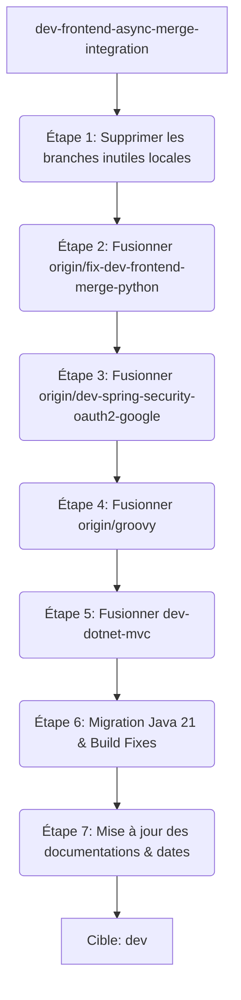

# Plan d'implémentation révisé : Fusion de toutes les branches Genesis & Nettoyage

Ce plan a été mis à jour pour inclure la mise à jour des documentations du projet (le `README.md` principal et les documents dans `docs/`) avec l'ajout de la date du jour et des nouvelles spécifications techniques (Java 21, IntelliJ 2025/2026, C#, Groovy, etc.).

---

## 🔍 Analyse de la configuration Gradle actuelle

### 1. Dans la branche d'intégration (`dev-frontend-async-merge-integration`)
*   **Java** : Version **17** configurée de manière classique (`sourceCompatibility` / `targetCompatibility`).
*   **Gradle Wrapper** : Version **9.5.1** (supporte pleinement Java 21+).
*   **Plugin IntelliJ** : Version **1.17.3**, plateforme IDE cible **2024.3**, plage de compatibilité `"243"` à `"254.*"`.

### 2. Dans la branche C# (`dev-dotnet-mvc`)
*   **Java** : Version **21** déjà configurée via la **Java Toolchain** (`toolchain { languageVersion.set(JavaLanguageVersion.of(21)) }`).
*   **Plugin IntelliJ** : Version **1.17.3**, plateforme IDE cible **2025.3** (IU), build minimal `"253"`.

---

## 📋 Inventaire des branches, contributeurs et fonctionnalités

Voici la répartition des branches avec leurs contributeurs principaux et leurs fonctionnalités respectives :

### 1. Branche de Base (Intégration)
*   **`dev-frontend-async-merge-integration`** : Branche d'intégration de base.
    *   **Contributeurs principaux** : Toky20, Chan Alex, Voarisoa Marinah, tahianarak, Nomena Vahatriniaina.
    *   **Features** : Contient la refonte asynchrone du plugin et les générateurs frontend (Vue, React, Angular, Django).

### 2. Branches Actives à Fusionner (avec contributeurs)
*   **`dev-dotnet-mvc`** 
    *   **Contributeurs principaux** : Nomena Vahatriniaina, Voarisoa Marinah.
    *   **Features** : Scaffolding .NET MVC (C#), optimisations UI, et ajout de `GenesisGenerateAction` / `GenesisWizardDialog` pour lancer le wizard depuis le menu **Tools > Genesis Project Generator** (essentiel pour Rider, PyCharm, WebStorm).
*   **`det-dotnet-mvc-release`** 
    *   **Contributeurs principaux** : Nomena Vahatriniaina, Voarisoa Marinah.
    *   **Features** : Version antérieure de `dev-dotnet-mvc`.
*   **`origin/dev-spring-security-oauth2-google`** 
    *   **Contributeur principal** : Toky20.
    *   **Features** : Ajout de la documentation et des configurations pour l'authentification Google OAuth2 dans `framework-securities.yaml`.
*   **`origin/groovy`** (englobe les branches `feat/dockerize-java-dotnet` et `feat/add-groovy`)
    *   **Contributeur principal** : sergianafr.
    *   **Features** : Support du langage Groovy (types, mock data), support du framework Grails, et fichiers Docker compose pour Spring Boot, .NET, et NestJS.
*   **`origin/fix-dev-frontend-merge-python`** 
    *   **Contributeur principal** : RASOLOMANDIMBY Nomenjanahary Thomis.
    *   **Features** : Automatisation de la création du `venv` pour Django et nettoyage des templates de base Django.

### 3. Branches Mises de Côté
*   **`dev-apj-project`** : Écartée à la demande de l'utilisateur.
    *   **Contributeur principal** : zazart.
*   **`dev-disperse-configuration-file`** : **Écartée / Mise de côté**.
    *   **Contributeur principal** : Toky20.
    *   **Raison de l'exclusion** : Branche obsolète incompatible avec l'architecture asynchrone récente. Nous conservons le format consolidé actuel pour les fichiers YAML.

---

## 🛠️ Plan de configuration technique (Java 21 & IntelliJ 2025/2026)

### 1. Fichier `build.gradle.kts` (racine)
Configuration de la **Java Toolchain** globale sur la version **21** :
```kotlin
subprojects {
    java {
        toolchain {
            languageVersion.set(JavaLanguageVersion.of(21))
        }
    }
    tasks {
        withType<org.jetbrains.kotlin.gradle.tasks.KotlinCompile> {
            kotlinOptions.jvmTarget = "21"
        }
    }
}
```

### 2. Fichier `genesis-intellij/build.gradle.kts`
Utilisation d'IntelliJ **2026.1.3** (IU) localement tout en garantissant la compatibilité d'IntelliJ 2025.x à 2026.x :
```kotlin
val platformVersion = "2026.1.3"

intellij {
    version.set(platformVersion)
    type.set("IU")
}

tasks {
    patchPluginXml {
        sinceBuild.set("251")     // Supporte IntelliJ 2025.1 et supérieur
        untilBuild.set("262.*")   // Supporte IntelliJ 2026.x
    }
}
```

---

## 📝 Documentations à mettre à jour (avec la date du 8 Juin 2026)

### 1. [MODIFY] [README.md](file:///Users/nomena/TAFF/genesis-project/README.md)
*   Mise à jour des prérequis techniques (Java 21 global, IntelliJ 2025/2026, Rider, PyCharm, WebStorm).
*   Ajout des nouvelles fonctionnalités consolidées (Grails/Groovy, Dockerization, C# .NET MVC).

### 2. [MODIFY] [merge_plan.md](file:///Users/nomena/TAFF/genesis-project/docs/merge_plan.md)
*   Mise à jour de la date à **8 Juin 2026**.
*   Adaptation du plan de fusion pour exclure la dispersion et inclure le support Groovy/Grails, Google OAuth2, et Docker.

### 3. [MODIFY] [project_understanding.md](file:///Users/nomena/TAFF/genesis-project/docs/project_understanding.md)
*   Mise à jour de la date à **8 Juin 2026**.
*   Ajout de la section sur Groovy/Grails (langage ID 5) et la dockerization de Spring Boot / .NET / NestJS.

---

## ⚡ Stratégie de Fusion (Étape par Étape)



### Étape 1 : Nettoyage initial des branches inutiles locales
Suppression des branches locales et distantes redondantes listées dans l'inventaire afin de désencombrer le dépôt.

### Étape 2 : Fusion de `origin/fix-dev-frontend-merge-python`
*   Automatisation du venv Django.

### Étape 3 : Fusion de `origin/dev-spring-security-oauth2-google`
*   Ajout de la documentation OAuth2 Google dans `framework-securities.yaml`.

### Étape 4 : Fusion de `origin/groovy`
*   Ajout du support Groovy/Grails et Docker compose. Conflits dans `languages.json` et `frameworks.yaml` à résoudre.

### Étape 5 : Fusion de `dev-dotnet-mvc`
*   **Conflit critique attendu** :
    *   *UI du Plugin* : Fusionner la logique de l'assistant Swing UI asynchrone tout en ré-introduisant les options .NET.
    *   *Rider Action* : Intégrer l'action menu de lancement du wizard pour Rider dans `plugin.xml`.
    *   *YAML/JSON* : Fusionner les configurations .NET MVC dans `frameworks-mvc.yaml` et `databases.json`.

### Étape 6 : Migration Java 21 et Ajustements de Compatibilité Gradle
*   Mise en œuvre des ajustements Gradle décrits (Toolchain Java 21 global, versions d'IDE cibles).

### Étape 7 : Mise à jour des documentations et des dates
*   Modification de [README.md](file:///Users/nomena/TAFF/genesis-project/README.md), [merge_plan.md](file:///Users/nomena/TAFF/genesis-project/docs/merge_plan.md) et [project_understanding.md](file:///Users/nomena/TAFF/genesis-project/docs/project_understanding.md) avec la date du **8 Juin 2026** et les nouvelles spécifications.

---

## 🔍 Plan de vérification

### Tests automatisés
- Exécution de l'ensemble des tests unitaires du module core : `./gradlew test`.

### Vérification manuelle
1.  **Compilation générale** : `./gradlew build` en Java 21.
2.  **Plugin Sandbox** :
    - Lancer le plugin en Sandbox : `./gradlew genesis-intellij:runIde`.
    - Vérifier la présence du menu **Tools > Genesis Project Generator** (support Rider/PyCharm/WebStorm).
    - Vérifier que la génération de projets .NET MVC et Django (avec création automatique du venv) fonctionne parfaitement.
