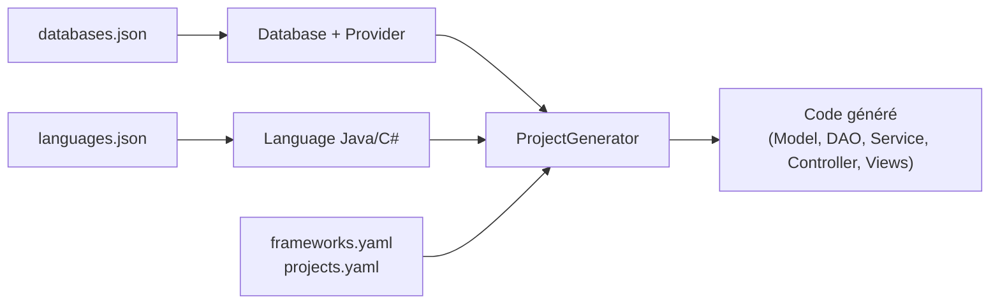

# Compréhension Globale de l'Architecture & Audit de `genesis-core`

**Date d'établissement :** 17 Mars 2026  
**Scope :** Module `genesis-core` du projet Genesis — Couche métier, connexion DB, configuration langages & frameworks.

---

## 1. Vue d'ensemble de l'architecture

Le module `genesis-core` est le cœur du projet Genesis. Il lit les métadonnées d'une base de données (tables, vues, colonnes, contraintes) et génère du code source (projets Spring Boot API, .NET MVC, etc.) à partir de templates.

### Flux principal

### Fichiers de configuration clés

| Fichier | Format | Rôle |
|---------|--------|------|
| [databases.json](file:///Users/nomena/TAFF/genesis-project/genesis-core/src/main/resources/data_genesis/json/databases.json) | JSON | Définition des SGBD supportés (types, drivers, ports et classes) |
| [languages.json](file:///Users/nomena/TAFF/genesis-project/genesis-core/src/main/resources/data_genesis/json/languages.json) | JSON | Types cibles Java/C#, annotations, mocks, criteria |
| [constraint-queries.yaml](file:///Users/nomena/TAFF/genesis-project/genesis-core/src/main/resources/data_genesis/yaml/constraint-queries.yaml) | YAML | Requêtes SQL de détection des contraintes CHECK |
| [frameworks.yaml](file:///Users/nomena/TAFF/genesis-project/genesis-core/src/main/resources/data_genesis/yaml/frameworks.yaml) | YAML | Config des frameworks backend (Spring, .NET) |
| [frameworks-mvc.yaml](file:///Users/nomena/TAFF/genesis-project/genesis-core/src/main/resources/data_genesis/yaml/frameworks-mvc.yaml) | YAML | Config des frameworks MVC (Spring MVC, .NET MVC) |
| [projects.yaml](file:///Users/nomena/TAFF/genesis-project/genesis-core/src/main/resources/data_genesis/yaml/projects.yaml) | YAML | Config des types de projets (Maven, ASP) |
| [input-type-mapping.json](file:///Users/nomena/TAFF/genesis-project/genesis-core/src/main/resources/data_genesis/json/input-type-mapping.json) | JSON | Mapping types frontend pour les formulaires |

---

## 2. SGBD supportés et versions requises (Drivers JDBC)

| SGBD | Driver JDBC | Version du Driver | Port par défaut | Classe Provider |
|------|-------------|-------------------|-----------------|-----------------|
| **MySQL** | `com.mysql.cj.jdbc.Driver` | `mysql-connector-j` **9.0.0** | 3306 | [MySQLDatabase.java](file:///Users/nomena/TAFF/genesis-project/genesis-core/src/main/java/org/labs/genesis/connexion/providers/MySQLDatabase.java) |
| **PostgreSQL** | `org.postgresql.Driver` | `postgresql` **42.7.3** | 5432 | [PostgreSQLDatabase.java](file:///Users/nomena/TAFF/genesis-project/genesis-core/src/main/java/org/labs/genesis/connexion/providers/PostgreSQLDatabase.java) |
| **SQL Server** | `com.microsoft.sqlserver.jdbc.SQLServerDriver` | `mssql-jdbc` **12.8.1.jre11** | 1433 | [SQLServerDatabase.java](file:///Users/nomena/TAFF/genesis-project/genesis-core/src/main/java/org/labs/genesis/connexion/providers/SQLServerDatabase.java) |
| **Oracle** | `oracle.jdbc.driver.OracleDriver` | `ojdbc8` **19.8.0.0** | 1521 | [OracleDatabase.java](file:///Users/nomena/TAFF/genesis-project/genesis-core/src/main/java/org/labs/genesis/connexion/providers/OracleDatabase.java) |

### Versions minimales réelles supportées

Le tableau ci-dessous croise les exigences du **driver JDBC** avec les **fonctions SQL réellement utilisées** dans les requêtes de contraintes ([constraint-queries.yaml](file:///Users/nomena/TAFF/genesis-project/genesis-core/src/main/resources/data_genesis/yaml/constraint-queries.yaml)) et dans le code Java des providers.

| SGBD | Version minimale réelle | Versions stables recommandées | Raison limitante |
|------|------------------------|-------------------------------|------------------|
| **MySQL** | **8.0.16** | 8.0.x, 8.4 LTS, 9.x | CHECK constraints + `REGEXP_SUBSTR` |
| **PostgreSQL** | **9.3** | 12.x, 13.x, 14.x, 15.x, 16.x, 17.x | `CROSS JOIN LATERAL` |
| **SQL Server** | **2012** | 2016, 2017, 2019, 2022 | `TRY_CAST()` |
| **Oracle** | **12c R2 (12.2)** | 12c, 18c, 19c (LTS), 21c, 23ai | Driver `ojdbc8` certifié 12.2+ |

> [!IMPORTANT]
> **MySQL 5.7 est incompatible** malgré le support du driver JDBC 9.0.0. Les requêtes de contraintes échoueront systématiquement à cause de `REGEXP_SUBSTR`, de l'usage des CTE (`WITH`) et de l'absence de la table `information_schema.CHECK_CONSTRAINTS`.

---

## 3. Support des contraintes de schéma

### Matrice de support des contraintes

Le code de détection des contraintes est spécifique à chaque provider et utilise les requêtes SQL définies dans `constraint-queries.yaml`.

| Contrainte | MySQL | PostgreSQL | SQL Server | Oracle |
|------------|:-----:|:----------:|:----------:|:------:|
| **PRIMARY KEY** | ✅ | ✅ | ✅ | ✅ |
| **FOREIGN KEY** | ✅ | ✅ | ✅ | ✅ |
| **NOT NULL** | ✅ | ✅ | ✅ | ✅ |
| **UNIQUE** | ✅ | ✅ | ✅ | ✅ |
| **CHECK – Min numérique (>=)** | ✅ | ✅ | ✅ | ✅ |
| **CHECK – Max numérique (<=)** | ✅ | ✅ | ✅ | ✅ |
| **CHECK – Min strict (>)** | ✅ | ✅ | ✅ | ✅ |
| **CHECK – Max strict (<)** | ✅ | ✅ | ✅ | ✅ |
| **CHECK – Past date** | ❌ | ✅ | ✅ | ✅ |
| **CHECK – Future date** | ❌ | ✅ | ✅ | ✅ |
| **CHECK – Not blank** | ✅ | ✅ | ✅ | ✅ |
| **CHECK – Min length** | ✅ | ✅ | ✅ | ✅ |
| **CHECK – Regex pattern** | ✅ | ✅ | ✅ (LIKE) | ✅ (REGEXP_LIKE) |
| **DEFAULT VALUE** | ✅ | ✅ | ✅ | ✅ |
| **Column size (maxLength)** | ✅ | ✅ | ✅ | ✅ |
| **Decimal precision** | ✅ | ✅ | ✅ | ✅ |

### Limitations et particularités critiques

*   **Clés primaires composites :** ⚠️ **Partiellement supportées** — le code de `fetchPrimaryKeys()` utilise `setPrimaryColumn(column)` avec un seul champ dans `TableMetadata`. Seule la dernière colonne PK trouvée est conservée.
*   **Vues :** Si la vue n'a pas de PK, le code cherche une colonne nommée `id`, sinon prend la première colonne comme PK fictive.
*   **Oracle Schema Owner :** Pour Oracle, le code utilise `credentials.getUser()` au lieu du schema, supposant que l'utilisateur est le propriétaire unique du schéma.
*   **Bugs identifiés :** Un bug logique existe dans `ColumnMetadata.setDefaultValue()`. La condition utilise `||` (OR) avec des négations, empêchant l'exclusion correcte des valeurs par défaut pour les colonnes temporelles.

---

## 4. Langages & Frameworks supportés

### Frameworks Backend
1. **Spring REST API** (Java)
2. **.NET API** (C#)
3. **Spring Eureka Server** (Java)
4. **Spring API Gateway** (Java)
5. **.NET MVC** (C#)
6. **Spring MVC** (Java)

### Frameworks Frontend
*   **Angular** (TypeScript)
*   **React** (TypeScript)
*   **Vue.js** (TypeScript)
